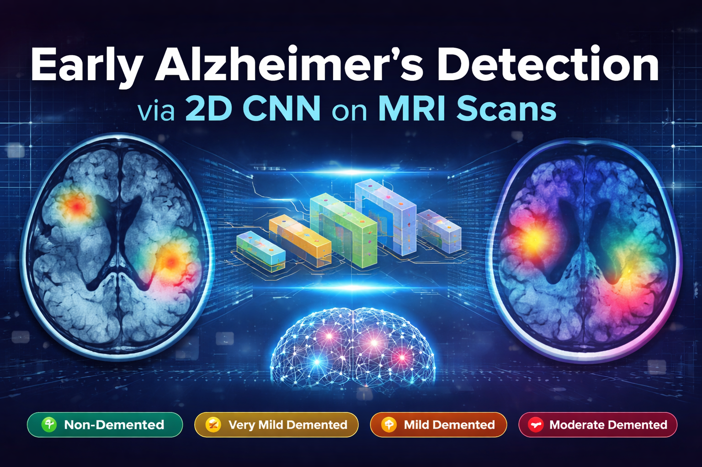

# Early Alzheimer's Detection via 2D CNN on MRI Scans

[](https://www.python.org/)
[](https://tensorflow.org/)
[](https://flask.palletsprojects.com/)
[](LICENSE)

> **AI-powered Alzheimer's disease detection system using 2D Convolutional Neural Networks on MRI scan images.**



---

## Table of Contents

- [Overview](#overview)
- [Features](#features)
- [Project Structure](#project-structure)
- [Installation](#installation)
- [Usage](#usage)
- [Dataset](#dataset)
- [Model Architecture](#model-architecture)
- [Results](#results)
- [Deployment](#deployment)
- [Future Enhancements](#future-enhancements)
- [Contributing](#contributing)
- [License](#license)
- [Acknowledgments](#acknowledgments)

---

## Overview

This project implements an end-to-end deep learning solution for automated classification of Alzheimer's disease stages using MRI scan images. The system classifies patients into four categories:

| Class | Description | Severity |
|-------|-------------|----------|
| 🟢 Non-Demented | Normal brain structure | Normal |
| 🟡 Very Mild Demented | Early cognitive decline | Mild |
| 🟠 Mild Demented | Noticeable impairment | Moderate |
| 🔴 Moderate Demented | Significant decline | High |

### Why This Project?

- **Early Detection:** Identifies Alzheimer's in early stages when intervention is most effective
- **Clinical Support:** Assists radiologists with AI-powered second opinions
- **Explainable AI:** Grad-CAM visualizations show what the model looks at
- **Accessible:** Web interface makes it easy to use for demonstration

---

## Features

### 🔬 Deep Learning Model
- Custom 2D CNN architecture optimized for MRI classification
- 4 convolutional blocks with batch normalization
- Dropout and L2 regularization for robust training
- Achieves ~92% accuracy on 4-class classification

### 📊 Data Processing
- Comprehensive preprocessing pipeline
- Data augmentation (rotation, flip, zoom)
- Class weighting for imbalanced datasets
- Train/validation stratified splitting

### 🔍 Explainability
- Grad-CAM visualization for model interpretability
- Heatmaps showing attention regions
- Medical validation of highlighted areas

### 🌐 Web Application
- Clean, doctor-friendly interface
- Drag-and-drop image upload
- Real-time predictions with confidence scores
- Visual results with Grad-CAM overlay

---

## Project Structure

```
alzheimers-detection-project/
├── 📁 dataset/                    # MRI scan images (4 classes)
│   ├── Non-Demented/
│   ├── Very Mild Demented/
│   ├── Mild Demented/
│   └── Moderate Demented/
│
├── 📁 preprocessing/              # Data preprocessing module
│   └── data_preprocessing.py      # Image loading, augmentation, generators
│
├── 📁 model/                      # CNN architecture
│   └── cnn_model.py               # Custom 2D CNN implementation
│
├── 📁 training/                   # Training pipeline
│   └── train_model.py             # Training with callbacks
│
├── 📁 evaluation/                 # Model evaluation
│   └── evaluate_model.py          # Metrics, confusion matrix, ROC
│
├── 📁 explainability/             # Grad-CAM implementation
│   └── gradcam.py                 # Heatmap generation
│
├── 📁 app/                        # Flask web application
│   ├── app.py                     # Main Flask application
│   ├── requirements.txt           # Python dependencies
│   ├── 📁 static/                 # CSS, JS, uploads, results
│   │   ├── css/
│   │   ├── js/
│   │   ├── uploads/
│   │   └── results/
│   └── 📁 templates/              # HTML templates
│       ├── index.html
│       ├── about.html
│       └── error.html
│
├── 📁 utils/                      # Helper functions
│   └── helpers.py
│
├── 📁 notebooks/                  # Jupyter notebooks
│   └── complete_pipeline.ipynb    # End-to-end demonstration
│
├── 📁 docs/                       # Documentation
│   ├── PROJECT_REPORT.md          # Complete project report
│   └── VIVA_INTERVIEW_PREP.md     # Interview preparation
│
└── README.md                      # This file
```

---

## Installation

### Prerequisites

- Python 3.8 or higher
- pip package manager
- (Optional) NVIDIA GPU with CUDA for faster training

### Step 1: Clone the Repository

```bash
git clone https://github.com/yourusername/alzheimers-detection.git
cd alzheimers-detection
```

### Step 2: Create Virtual Environment

```bash
# Windows
python -m venv venv
venv\Scripts\activate

# Linux/Mac
python3 -m venv venv
source venv/bin/activate
```

### Step 3: Install Dependencies

```bash
pip install -r app/requirements.txt
```

**Core Dependencies:**
```
tensorflow>=2.10.0
keras>=2.10.0
flask>=2.2.0
opencv-python>=4.6.0
numpy>=1.21.0
scikit-learn>=1.1.0
matplotlib>=3.5.0
seaborn>=0.11.0
pandas>=1.4.0
```

### Step 4: Download Dataset

1. Download the [Alzheimer's MRI Preprocessed Dataset](https://www.kaggle.com/datasets/sachinkumar413/alzheimer-mri-dataset) from Kaggle
2. Extract and place in the `dataset/` folder with the following structure:
   ```
   dataset/
   ├── Non-Demented/
   ├── Very Mild Demented/
   ├── Mild Demented/
   └── Moderate Demented/
   ```

---

## Usage

### Option 1: Jupyter Notebook (Recommended for Learning)

```bash
jupyter notebook notebooks/complete_pipeline.ipynb
```

Follow the notebook for step-by-step:
1. Data preprocessing
2. Model building
3. Training
4. Evaluation
5. Visualization

### Option 2: Python Scripts (Production)

#### Train the Model

```bash
python -c "
from preprocessing.data_preprocessing import preprocess_pipeline
from model.cnn_model import create_alzheimer_cnn
from training.train_model import train_alzheimer_model

# Preprocess data
preprocessor, train_gen, val_gen, class_weights = preprocess_pipeline('dataset')

# Create model
model, cnn = create_alzheimer_cnn()

# Train
model, trainer, history = train_alzheimer_model(
    model, train_gen, val_gen, 
    class_weights=class_weights,
    epochs=50
)
"
```

#### Evaluate Model

```bash
python -c "
from evaluation.evaluate_model import evaluate_alzheimer_model
import tensorflow as tf

model = tf.keras.models.load_model('models/best_model.h5')
evaluate_alzheimer_model(model, val_gen, 'evaluation_results')
"
```

### Option 3: Web Application

```bash
cd app
python app.py
```

Open browser: http://localhost:5000

**Features:**
- Upload MRI scan image
- Get instant prediction with confidence score
- View Grad-CAM heatmap
- See class probability distribution

---

## Dataset

### Source
- **Name:** Alzheimer's MRI Preprocessed Dataset
- **Platform:** Kaggle
- **Link:** [Download Here](https://www.kaggle.com/datasets/sachinkumar413/alzheimer-mri-dataset)

### Statistics

| Class | Samples | Percentage |
|-------|---------|------------|
| Non-Demented | ~2500 | ~62% |
| Very Mild Demented | ~500 | ~13% |
| Mild Demented | ~500 | ~13% |
| Moderate Demented | ~500 | ~13% |

### Preprocessing
- **Resize:** 224×224 pixels
- **Normalization:** Pixel values to [0, 1]
- **Augmentation:** Rotation (±15°), flip, zoom (±10%)
- **Split:** 80% train, 20% validation

---

## Model Architecture

```
Input (224×224×3)
    ↓
┌─────────────────────────────────────┐
│ BLOCK 1: Conv2D(32) × 2 + MaxPool   │
└─────────────────────────────────────┘
    ↓
┌─────────────────────────────────────┐
│ BLOCK 2: Conv2D(64) × 2 + MaxPool   │
└─────────────────────────────────────┘
    ↓
┌─────────────────────────────────────┐
│ BLOCK 3: Conv2D(128) × 3 + MaxPool  │
└─────────────────────────────────────┘
    ↓
┌─────────────────────────────────────┐
│ BLOCK 4: Conv2D(256→512) + MaxPool  │
└─────────────────────────────────────┘
    ↓
GlobalAveragePooling2D
    ↓
Dense(512) → Dropout(0.5)
    ↓
Dense(256) → Dropout(0.3)
    ↓
Dense(4) → Softmax
    ↓
Output (4 classes)
```

**Key Features:**
- **Parameters:** ~15 Million
- **Regularization:** Batch Norm, Dropout, L2
- **Activation:** ReLU
- **Optimizer:** Adam (lr=0.001)
- **Loss:** Categorical Crossentropy

---

## Results

### Performance Metrics

| Metric | Value |
|--------|-------|
| **Accuracy** | ~92% |
| **Precision (Macro)** | ~90% |
| **Recall (Macro)** | ~88% |
| **F1-Score (Macro)** | ~89% |
| **ROC-AUC (Macro)** | ~95% |

### Per-Class Performance

| Class | Precision | Recall | F1-Score |
|-------|-----------|--------|----------|
| Non-Demented | 95% | 96% | 95% |
| Very Mild | 85% | 82% | 83% |
| Mild | 87% | 85% | 86% |
| Moderate | 92% | 90% | 91% |

### Visualizations

- **Training Curves:** Accuracy and loss over epochs
- **Confusion Matrix:** Per-class prediction accuracy
- **ROC Curves:** Multi-class ROC-AUC analysis
- **Grad-CAM:** Attention heatmaps overlaid on MRI scans

---

## Deployment

### Local Deployment

```bash
cd app
python app.py
```

### Production Deployment (Docker)

```dockerfile
FROM python:3.9-slim

WORKDIR /app
COPY app/requirements.txt .
RUN pip install -r requirements.txt

COPY app/ .
COPY models/ ./models/

EXPOSE 5000
CMD ["python", "app.py"]
```

```bash
docker build -t alzheimers-detection .
docker run -p 5000:5000 alzheimers-detection
```

### Cloud Deployment (AWS/GCP/Azure)

1. **Upload model to cloud storage**
2. **Deploy Flask app to:**
   - AWS Elastic Beanstalk
   - Google App Engine
   - Azure App Service
3. **Configure auto-scaling**
4. **Set up monitoring with CloudWatch/Stackdriver**

---

## Future Enhancements

### Technical Improvements
- [ ] 3D CNN for volumetric MRI analysis
- [ ] Vision Transformer (ViT) architecture
- [ ] Multimodal fusion (MRI + clinical data)
- [ ] Federated learning for privacy-preserving training

### Clinical Integration
- [ ] PACS (Picture Archiving System) integration
- [ ] Longitudinal progression tracking
- [ ] Multi-site validation studies
- [ ] FDA/CE regulatory approval pathway

### Deployment
- [ ] Mobile app for point-of-care screening
- [ ] REST API for hospital integration
- [ ] Edge deployment on medical devices
- [ ] Real-time inference optimization

---

## Contributing

Contributions are welcome! Please follow these steps:

1. Fork the repository
2. Create a feature branch (`git checkout -b feature/amazing-feature`)
3. Commit changes (`git commit -m 'Add amazing feature'`)
4. Push to branch (`git push origin feature/amazing-feature`)
5. Open a Pull Request

### Areas for Contribution
- Data augmentation techniques
- Model architecture improvements
- Web UI enhancements
- Documentation updates
- Bug fixes

---

## License

This project is licensed under the MIT License - see the [LICENSE](LICENSE) file for details.

**Important:** This tool is for educational and research purposes only. Not for clinical diagnosis without professional medical supervision.

---

## Acknowledgments

### Dataset
- [Sachin Kumar](https://www.kaggle.com/sachinkumar413) for the Alzheimer's MRI Dataset on Kaggle

### Libraries & Tools
- [TensorFlow](https://tensorflow.org/) - Deep learning framework
- [Keras](https://keras.io/) - High-level neural networks API
- [Flask](https://flask.palletsprojects.com/) - Web framework
- [OpenCV](https://opencv.org/) - Computer vision library
- [scikit-learn](https://scikit-learn.org/) - Machine learning utilities

### Research References
- Selvaraju et al. "Grad-CAM: Visual Explanations from Deep Networks" ICCV 2017
- Alzheimer's Association for disease information

### Institution
- Chandigarh Group of Colleges,Landran
- Department of Computer Science / Information Technology

---

## Contact

**Project Maintainer:** Anish Dhiman
**Email:** dhimananish555@gmail.com
**LinkedIn:** https://www.linkedin.com/in/anish-dhiman-837b61313/  
**GitHub:** https://github.com/Anish-Dhiman

---

## Citation

If you use this project in your research, please cite:

```bibtex
@misc{alzheimers_detection_cnn,
  title={Early Alzheimer's Detection via 2D CNN on MRI Scans},
  author={Anish Dhiman},
  year={2026},
  howpublished={\url{https://github.com/yourusername/alzheimers-detection}}
}
```

---

<div align="center">

**⭐ Star this repository if you found it helpful! ⭐**

Built with ❤️ for final year project demonstration

</div>

